## 并行资源导入

用于解决大型项目资源导入时间过长，切换平台时间过长的问题（经测试在默认设置下，开启后时间缩短为原耗时的一半，继续提高核心数应该能进一步提升速度）

在Project Settings->Editor下新增Asset Pipeline字段

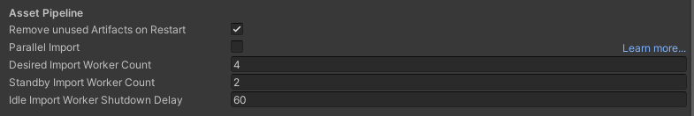

| Type                               | 描述                                                    | 设置                |
| ---------------------------------- | ------------------------------------------------------- | ------------------- |
| Remove unused Artifacts on Restart | 编辑器重启时自动清理Assets DataBase中没有用到的资源缓存 | 默认开启            |
| Parallel Import                    | 开启并行导入资源功能                                    | 默认关闭            |
| Desired Import Worker Count        | 期望的资源导入工作进程个数                              | 不超过CPU逻辑核数量 |
| Standby Import Worker Count        | 后备保留的最小工作进程个数，即使是空闲状态              | 小于期望进程个数    |
| Idle Import Worker Shutdown        | 关闭空间工作进程签等待时间                              |                     |

此外在编辑器的Preferences->Asset Pipeline窗口中，设置 Import Worker Count，默认设置为系统逻辑核的25% 

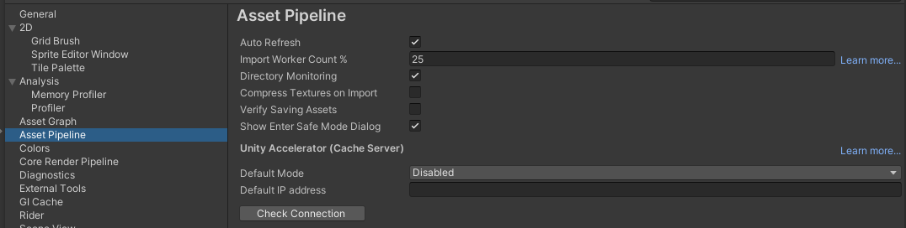

并行导入在编辑器Log中也会有所体现

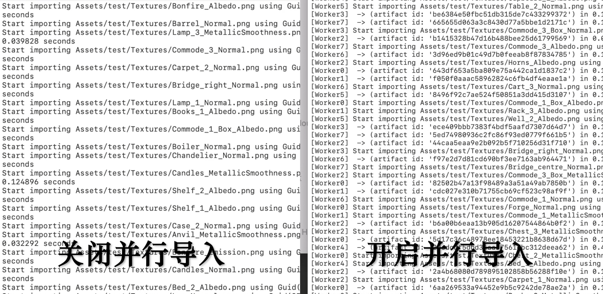

**注意事项**

1.该功能只在编辑器下使用，一旦开启，AssetDatabasel的一些APl,如Import,,Refresh,.CreateAsset接口同样有效变成并行处理。

2.该功能只有在导入图像和模型类型资源时会并行，其他资源类型不会生效。

3.由于并行导入在单独的进程中进行，任何脚本导入相关代码会在该进程中生效而不是在编辑器主进程中生效，所以存在一致性问题，所以尽量相关的导入脚本中不包含不确定性的上下文资源或静态变量。


## 资源导入工作流

### 1.手动编写工具 

**优点：**根据项目特点自定义安排导入工作流，并且可以和后续资源制作与大包工作流结合

**缺点：**存在开发和维护成本，会让编辑器菜单界面变得复杂，对新人理解工程不友好

**AssetPostprocessor：**

所有的资源类型都有对应的OnPreprocess接口，它会在资源被导入时调用

编写编辑器代码继承AssetPostprocesser对象，获取Importer自定义完成导入设置修改

伪代码：

```c#
public class XXXAssetPostprocessor : AssetPostprocessor
{
        public void OnPreprocessXXXAsset()
        {
                XXXAssetImporter xxxImporter = (XXXAssetImporter)assetImporter;
                xxxImporter.属性 = xxx
                ...
                xxxImporter.SaveAndReimport();
        }
}
```

参考资料：

[资源审核 - Unity 手册 (unity3d.com)](https://docs.unity3d.com/cn/2021.2/Manual/BestPracticeUnderstandingPerformanceInUnity4.html)

[UnityEditor.AssetPostprocessor - Unity 脚本 API (unity3d.com)](https://docs.unity3d.com/cn/2021.2/ScriptReference/AssetPostprocessor.html)


**注意：**

1.这种方式实现了资源的统一设置，但有时同类资源也有不同的导入设置，这是需要通过不同的文件夹对不同配置需求的同类资源进行区分，或者通过资源文件名区分，这样导入工具就还可以通过对路径的管理，通过做表达式或通配符进行分类配置。并对导入资源设置做持久化，可以继承[ScriptableObject](https://docs.unity3d.com/cn/current/Manual/class-ScriptableObject.html)对象来持久化设置，也可以与第二种方法结合使用Presets来完成，Presets是从ScriptableObject继承而来。

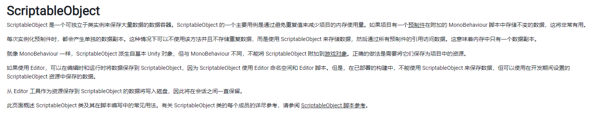

2.这样就解决了在资源导入时的资源统一设置问题和同类资源不同导入设置的问题，但在编辑时可能涉及人为误修改导致打包时出现问题，如果仅在打包时重新统一资源有可能导致有些问题只在打包后才出现，所以建议使用新的接口来保证资源统一

**AssetsModifiedProcessor**可以检测在编辑器下，被添加、删除、修改、移动的资源，并回调OnAssetsModified接口，通过该接口可以在资源修改时做相应的资源导入设置

```C#
AssetsModifiedProcessor（新试验接口）:
/// 资源被添加、删除、修改、移动时回调该对象的OnAssetsModified接口
/// <summary>
/// The OnAssetsModified method is called whenever an Asset has been changed in the project.
/// This methods determines if any Preset has been added, removed, or moved
/// and updates the CustomDependency related to the changed folder.
/// </summary>
void OnAssetsModified(string[] changedAssets, string[] addedAssets, string[] deletedAssets, AssetMoveInfo[] movedAssets)
{

        ...
} 
```

参考资料：

[Unity - Manual: Applying default presets to Assets by folder (unity3d.com)](https://docs.unity3d.com/Manual/DefaultPresetsByFolder.html)

### 2.利用Presets功能

Unity2018时加入的功能

**Presets**是将相同属性设置跨多个组件、资源或项目设置保存和应用的资源，该资源运行时没有效果，仅能在Uity编辑器下使用，不会随应用程序导出。

**优点：**使用简单方便，只需要Assets目录结构合理规范即可

**缺点：**无法和后续工作流整合，只适合做资源导入设置。

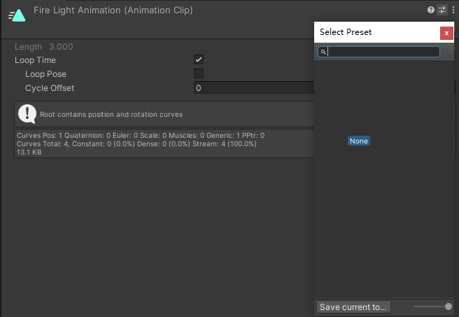

任意资源右上角的都有Presets按钮，打开Presets界面后可以序列化存储当前资源的设置

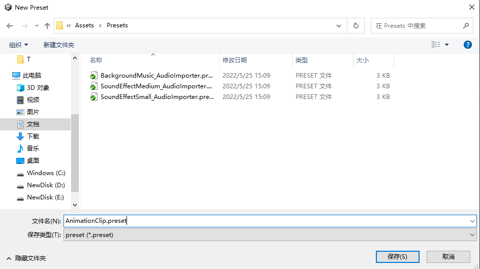

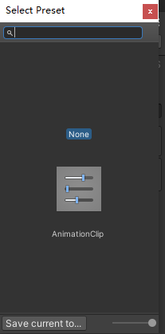

这样就可以很方便地应用此资源的设置到其他资源上。

同样资源的导入设置也可以持久化成Presets，而且可以将Presets资源添加到Project Settings -> Preset Manager中


这样就可以将统一的资源设置应用到导入的新对象或新资源上

在Preset Manager中可以为每一个Presets添加高级过滤搜索选项，具体支持的符号和通配符如下图：

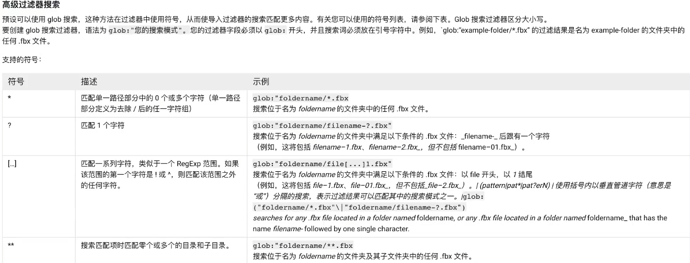

对于在第1种方法中遇到的资源变化问题，也可以同样使用OnAssetsModified接口进行完善，重新进行导入设置
只需将[Unity - Manual: Applying default presets to Assets by folder (unity3d.com)](https://docs.unity3d.com/Manual/DefaultPresetsByFolder.html)中的代码文件放到Editor文件夹下，同时删除Preset Manager中的默认预设并将Preset放到对应资产文件夹中即可。

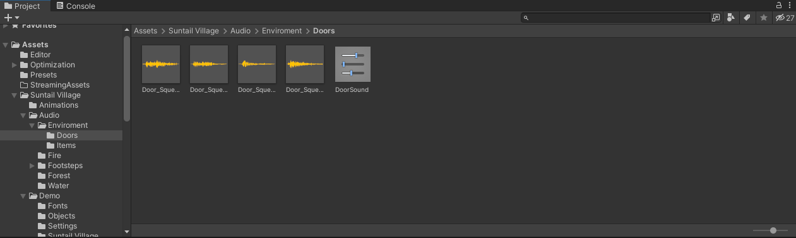

如上图所示，Doors文件夹中的文件不论进行什么修改，都会自动设置为与文件夹下的DoorSound Preset一致，任何人为的修改都会被忽略

[Supporting presets - Unity 手册 (unity3d.com)](https://docs.unity3d.com/cn/2021.3/Manual/SupportingPresets.html)

[Applying default presets to Assets by folder - Unity 手册 (unity3d.com)](https://docs.unity3d.com/cn/2021.3/Manual/DefaultPresetsByFolder.html)


### 3.利用AssetGraph工具

优点：功能全，覆盖Unity资源工作流全流程，节点化编辑，直观

缺点：有一定上手成本，一些自定义生成节点也需要开发，不是Unity标准包，Unity新功能支持较慢。

通过Package Manager -> Add package from git URL...安装AssetGraph

AssetGraph仓库地址：[Unity-Technologies/AssetGraph: Visual Workflow Automation Tool for Unity. (github.com)](https://github.com/Unity-Technologies/AssetGraph)

AssetGraph可以可视化编辑资源流，只需要添加OverWrite Import Settings节点就可以进行资源统一设置，也同样支持各种过滤方式

可以勾选Use As Postprocessor来检测新资源导入的回调流程，并可以通过点击Execute按钮执行整个资源处置流程

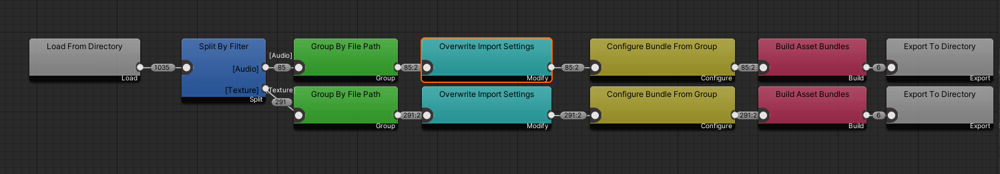

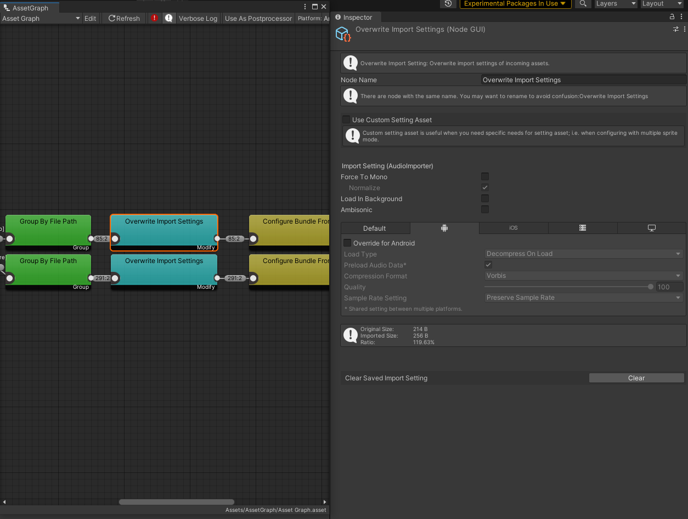

## Import Activity Window

可通过**Window-> Analysis-> Import Activity Window**启动

也可直接右键某个资源选择**View in Import Activity Window**

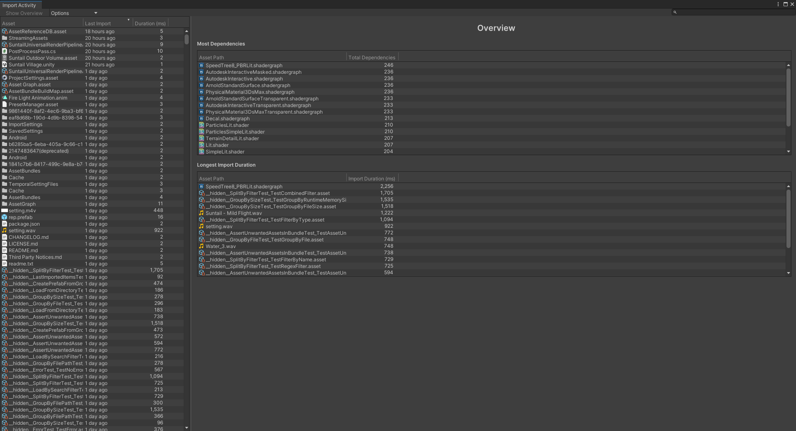

右侧Overview中显示了拥有最多依赖项资源的排序，和导入时间最长资源的排序

左侧会显示所有资源的上一次Import的时间和耗时

单选资源时，会显示资源的下列信息

| **Title**                      | **描述 Description**                                         |
| :----------------------------- | :----------------------------------------------------------- |
| **Asset**                      | 当前选定资源的名称。可以单击此字段在Project中查找该资源      |
| **GUID**                       | 资源的唯一GUID，可以使用该ID追踪它在项目中的所有引用         |
| **Asset Size**                 | 资源源文件的大小                                             |
| **Path**                       | 资源的文件路径，相对于项目的根目录                           |
| **Editor Revision**            | 创建此资源的Unity编辑器版本                                  |
| **Timestamp **                 | 资源被创建的时间，与该资源在`Library` folder.文件夹中的时间戳值相同 |
| **Duration **                  | 在最近的一次导入中，Unity 导入此资源所使用的时间(毫秒)       |
| **Reason for Import **         | 项目中导致此资产最近导入的更改(或更改)的说明，以及关联依赖项类型的详细信息 |
| **Produced Files / Artifacts** | 通常只有一个文件，但在编辑器使用过程中，Unity可能会生成资源导入的多个版本文件。因此可能会有多个文件的ID，并与资源的GUID不同 |
| **Dependencies**               | 控制资产状态的 Editor 和项目特定变量列表，如果发生更改，将触发资产的重新导入 |

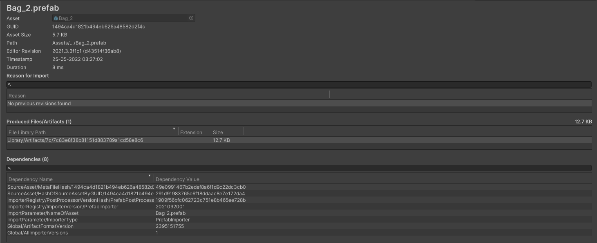

## Unity Analysis 新功能

### 自定义Profiler

#### 1.添加自定义模块

通过添加自定义Profiler模块来捕获并可视化项目中的特定性能数据，且无需编写代码

在[Profiler Module Editor](https://docs.unity.cn/cn/2021.3/Manual/profiler-module-editor.html)中，可自定义模块并将模块保存并添加到 Unity Profiler 窗口

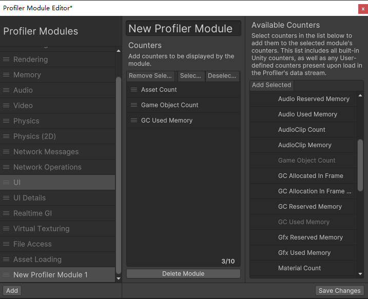

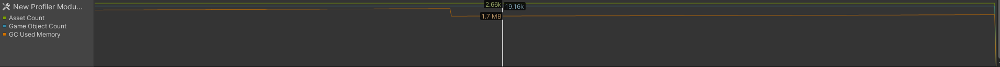

同时也可以使用代码添加：

```C#
//继承自ProfilerModule
public class TankEffectsProfilerModule : ProfilerModule
    
    //使用模块化元数据标记属性并指定模块显示名称
    [ProfilerModuleMetadata("Tank Effects")] 、
    static readonly ProfilerCounterDescriptor[] k_Counters = new ProfilerCounterDescriptor[]
{
    new ProfilerCounterDescriptor(GameStatistics.TankTrailParticleCountName, GameStatistics.TanksCategory),
    new ProfilerCounterDescriptor(GameStatistics.ShellExplosionParticleCountName, GameStatistics.TanksCategory),
    new ProfilerCounterDescriptor(GameStatistics.TankExplosionParticleCountName, GameStatistics.TanksCategory),
};
    //无参构造使用base构造
	public TankEffectsProfilerModule() : base(k_Counters) { }
```

#### 2.添加自定义Profiler计数器

下图为**Profiler counters**流的流程概述：


**Profilecounter** 和 **profilecountervalue** 支持**int**,**long**,**float**,**double**类型:

##### Profilecounter和profilecountervalue的对比

| Type                    | 使用情况                             | 取值方式                   |
| ----------------------- | ------------------------------------ | -------------------------- |
| Profilecounter API      | 数据变化不频繁（一帧或以上变化一次） | 一帧内非固定取值           |
| profilecountervalue API | 数据变化频繁（一帧变化多次）         | 仅在一帧结束时取最后一个值 |

具体使用代码编写的流程参考：[Profiler counters API](https://docs.unity.cn/Packages/com.unity.profiling.core@1.0/manual/profilercounter-guide.html)

#### 3.使用Profiler Maker标记并可视化代码

因开启**Deep Profiling**会导致增加大量开销影响性能，可以使用ProfilerMarker API，在想要标记的代码块开头与结尾调用**ProfilerMarker.Begin()**和**ProfilerMarker.End()**

```C#
using UnityEngine;
using Unity.Profiling;

public class ProfilerMarkerExample
{
    static readonly ProfilerMarker k_MyCodeMarker = new ProfilerMarker("My Code");

    void Update() {
        k_MyCodeMarker.Begin();
        Debug.Log("This code is being profiled");
        k_MyCodeMarker.End();
    }
}
```


更多功能详见：[ProfilerMarker API guide](https://docs.unity3d.com/Packages/com.unity.profiling.core@1.0/manual/profilermarker-guide.html)

#### 4.添加自定义模块细节面板

可以自定义模块的细节面板

```c#
 public class CustomDetailsViewController : ProfilerModuleViewController
 {   
    public CustomDetailsViewController(ProfilerWindow profilerWindow) : base(profilerWindow) { }

    protected override VisualElement CreateView()
    {
        // Create your UI.
    }
}
```

如绘制一个文本信息


同时可以结合Unity 的 UIToolkit 实现更多的效果


具体使用代码编写的流程参考：[Creating a custom module details panel - Unity 手册](https://docs.unity.cn/cn/2021.3/Manual/Profiler-customizing-details-view.html)

### Profile Analyzer

**Profile Analyzer**可以可视化与比较**Profiler**工具中捕获的标记数据

该工具可以对多帧**Profiler**数据进行比较分析，是对**Profiler**工具中已有的单帧分析结果的补充

#### 单帧数据分析

在菜单**Windows->Analysis**中启动

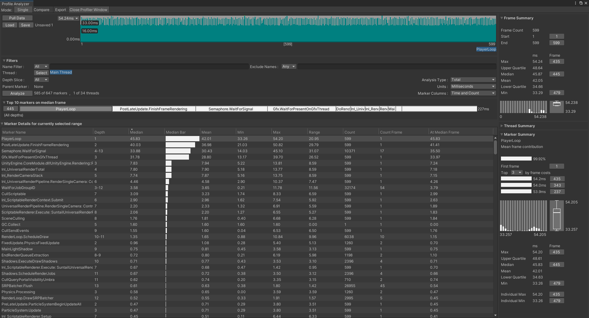

打开时只有**Load**按钮可用，该按钮用于读取先前保存的**Profile Analyzer**数据文件，以**.pdata**结尾，与**Profiler**保存的**.data**不同

 如需读取**Profiler**的数据，则需要打开**Profiler**窗口捕获或加载数据，保持**Profiler**窗口开启并点击**Profile Analyzer**的**PullData**按钮来拉取**Profiler**数据

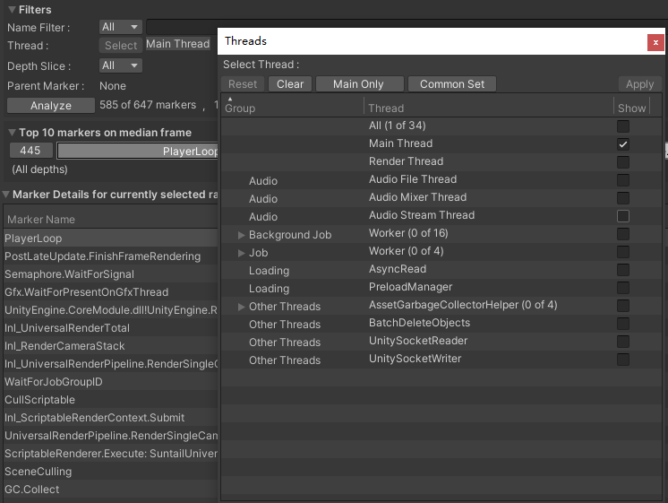

通过点击Select按钮可以选择查看不同的线程下该帧涉及的线程函数调用情况，可用于分析某个线程的性能开销


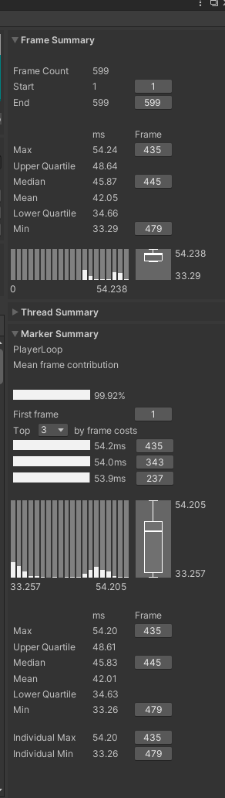

窗口右侧显示帧的统计信息，线程统计信息和标签统计信息，可以统计最大最小帧耗时，平均帧耗时，四分位数等信息

#### **多帧比较分析**

通过点击菜单栏的Compare按钮，可以切换到帧数据比较系统，可以比较不同帧中同一引擎函数耗时情况，可用于分析运行时为什么某一帧的耗时过高等问题

该功能不仅可以对比同一份数据文件中的不同帧，还可以再**Pull**一份数据进行两个数据文件中的帧数据比较，可用于对比优化迭代前后差异

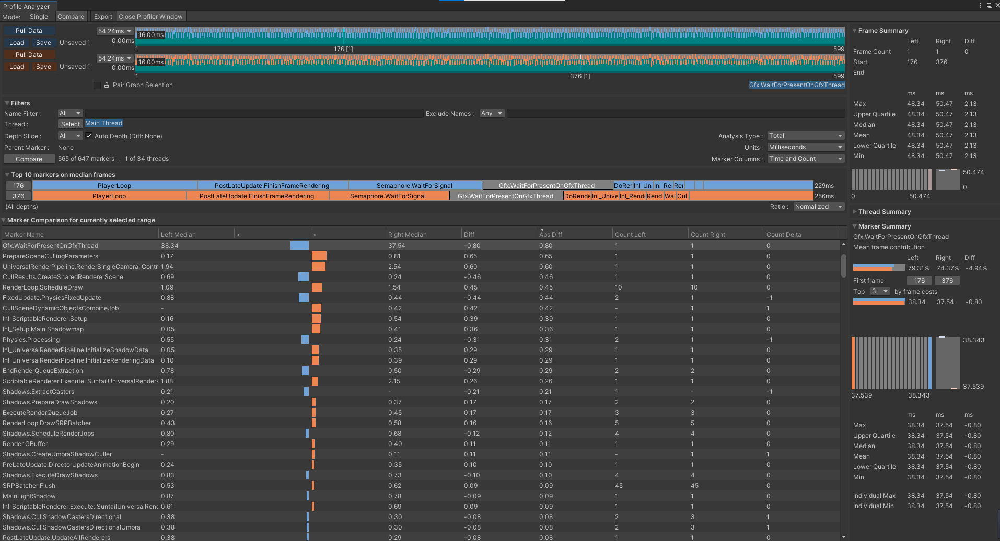

其次，还可以通过框选进行多段进行阶段性性能比较，还可以通过**Depth Slice**过滤函数调用层数进行比较

最后可以Save当前分析结果，也可导出对比分析报表**.csv**文件

### Code Coverage

该工具可以从自动化测试中导出代码覆盖率数据和报告。

此外，Code Coverage 包提供了 Coverage Recording 功能，使用此功能可以针对手动测试或在项目中没有自动测试时按需捕获覆盖率数据。

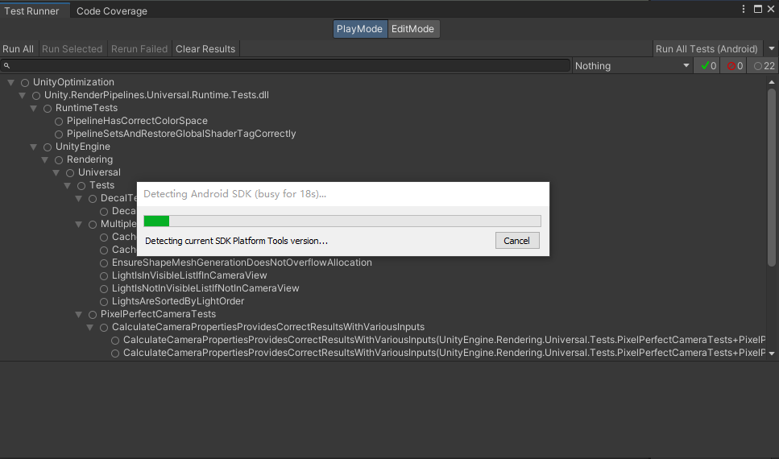

### Rendering Debugger

该工具可视化灯光、渲染、材质属性，用于发现渲染问题，优化场景和渲染配置

并且该工具可以运行时开启

在 **Window-> Analysis-> Rendering Debugger **开启窗口

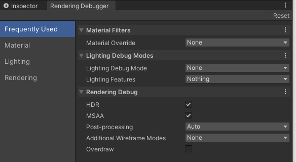

#### Frequently Used

展示了常用的属性选项

#### Material

可以可视化不同材质的属性以及光照复杂度和Gameobject的定点属性

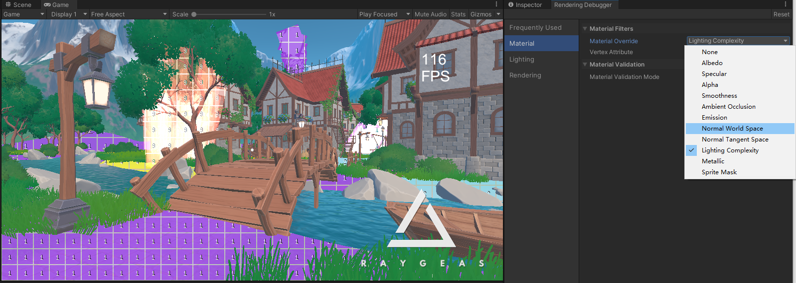

同时可以验证可视化材质属性在不同类型材质设置时相关数值的变化范围

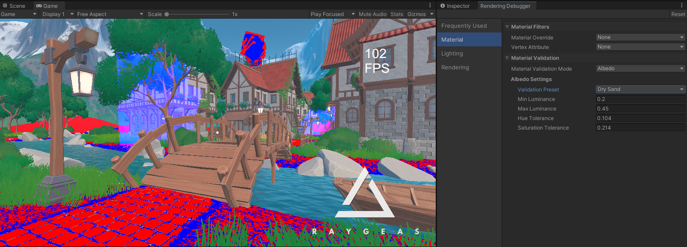


#### Lighting

用于可视化照明系统相关的不同设置，如级联阴影、反射、主光源、辅光贡献等

**LIghting Debug Mode ** 可以指定屏幕叠加哪种灯光和阴影的调试信息

**Lighting Features **部分可以指定光照特征，用于调试特定的最终照明结果

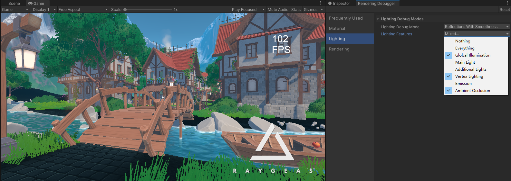


#### Rendering

用于可视化不同渲染功能，开关各种选项查找及调试渲染瓶颈

| 属性名称                   |                                               |
| -------------------------- | --------------------------------------------- |
| Map Overlays               | 指定哪种渲染管线纹理覆盖到屏幕上              |
| Map Size                   | 指定覆盖区域大小                              |
| HDR                        | 指定是否开启HDR（需在Pipeline Assets中设置）  |
| MSAA                       | 指定是否开启MSAA（需在Pipeline Assets中设置） |
| Post-processing            | 指定是否开启后处理效果                        |
| Additional Wireframe Modes | 指定使用何种线框模式                          |
| Overdraw                   | 指定是否开启过度绘制调试图                    |
| Pixel Validation           | 用于验证像素值范围                            |

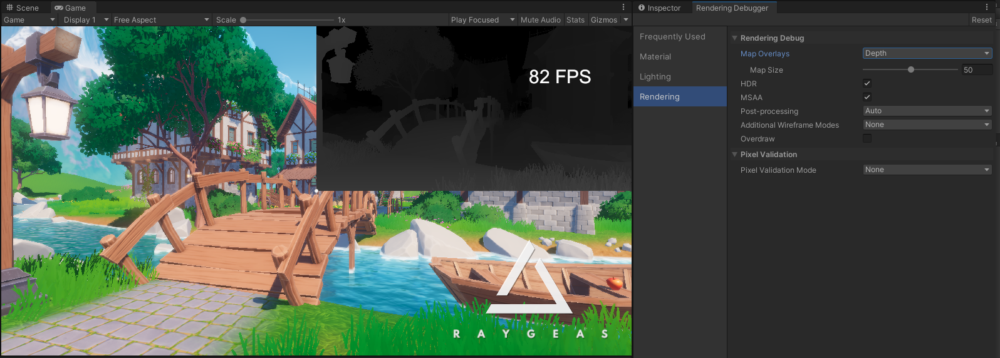

#### Runtime运行

该工具不仅能在编辑器模式下运行，也可以在编辑器PlayMode下或Player的Runtime下运行

在编辑器PlayMode下和PC端的Player的Runtime下，使用**Ctrl+Backspace**或者**Ctrl+Delete**启动

在主机端的Player的Runtime下，同时按下R3和L3开启

在移动端的Player的Runtime下，三根手指同时点按屏幕两次开启


**注意：**1.该工具目前没有官方文档

​			2.经测试在移动端部分功能无效

​			3.若想在Runtime下运行，需在构建时勾选Development Build选项，并确保Strip Debug Variants**不要勾选**

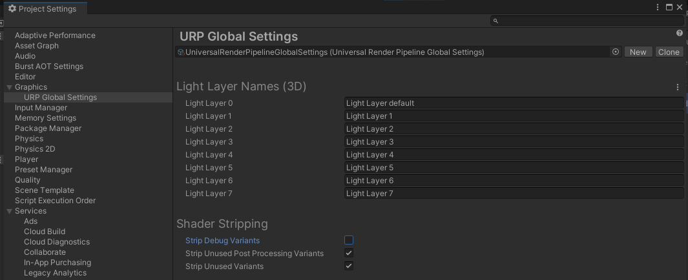


