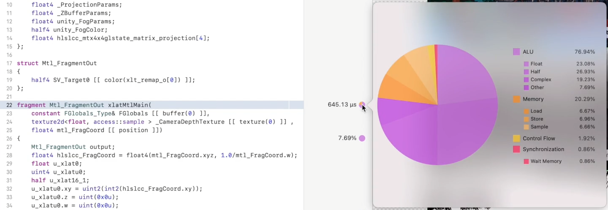

# XCode Frame Capture工具

**Xcode Frame Capture**工具运行在**matal API**下，可以用于分析渲染流程的瓶颈与问题，是优化移动平台渲染时非常直观的工具

## 前置设置

### 1.Unity设置

#### 打包设置

将**Build Setting**中的**Development Build**打开

### 2.Xcode设置

#### 开启功能

在工具栏**Edit Scheme->Run**页面中将**GPU Frame Capture**改为**Metal**（**不要使用Automatically Enabled**）

并勾选 **Profile GPU Trace after capture**

**详见**[Enabling Frame Capture | Apple Developer Documentation](https://developer.apple.com/documentation/metal/debugging_tools/enabling_frame_capture?preferredLanguage=occ)

#### 设置设备信息

打开项目设置的General页面设置设备信息

#### 添加证书

在Xcode->Preferences->Accounts页面点击左下角+登陆Apple ID并下载证书

在项目设置的Signing & Capabilities页面中勾选Automatically Manage signing添加签字并选择刚添加的账号

若爆红说明该账号不支持设备的IPA打包，需要关闭下面的In-App Purchase

## 工具介绍

### 性能总览

连接设备到机器上并运行，等待打包并安装后会自动运行，点击切换到show debugg navigator页面

​                  

**左侧的标签页中：**

| 名称          | 内容描述                                                     |
| ------------- | ------------------------------------------------------------ |
| CPU           | 显示当前应用程序下CPU负载情况，以及主线程、各个工作线程和后台线程的负载情况，可以方便地了解到当前应用程序开启了哪些线程及各线程的情况 |
| Memory        | 显示当前系统内存情况和当前应用程序占用的内存情况             |
| Energy Impact | 显示当前应用程序下的耗电量情况，并分类显示各部分的功耗情况   |
| Disk          | 显示存储器读写情况                                           |
| Network       | 显示网络读写情况                                             |
| FPS           | 显示当下GPU的概况，以及设备整体顶点着色器，片元着色器的负载情况 |

### Frame Capture

点击按钮，并等待**Capture**

当左侧出现**Capture GPU Workload**代表捕获完成

**1.左侧Summary标签页显示了当前程序GPU端的整体状况，包括性能、显存、以及可能与显存、带宽、性能有关的问题，具体的详细信息可以切换到对应的insights查看。**

**2.Counters标签页面是类似Unity Profiler的性能分析可视化工具，并可以显示如Vertices，Vertex Shader Time等Unity Profiler没有的详细信息，并可以搭配下方的渲染队列进行快速定位跳转**

**3.Memory标签页面显示各部分内存占用情况，并可视化展示各资源占用的部分，可以用来定位优化过大的资源、贴图等**

**4.渲染指令队列，可以通过下方的标签按钮进行draw call指令的过滤防止过多无关的draw call指令扰乱分析，然后可以像Profiler的操作一样展开队列并逐个查看该部分使用的相关贴图资源，draw call等信息，且该工具会绘制整个渲染流程图，可以方便定位到不容易发现的渲染问题，后面有紫色三角形叹号标志的为系统检查出的渲染问题，可以重点关注**

**当展开单个draw call时，可以查看该draw call的buffer、相关资源、管线状态、性能等信息，且当前调试的设备也会显示对应的draw call画面**

#### Performance标签下：

- 所有的性能指标中，以Limiter限制器结尾的，都是工作加暂停（主要为同步的等待时间）的总开销，以Utilization利用率结尾的代表实际的工作时间，相同的性能指标，以Limiter结尾的数值一定会大于Utilization结尾的数值
- 一般用Limiter来定位性能瓶颈，用Utilization来定义使用效率
- 需要每项的更详细解释需要鼠标悬停至该项目（Xcode官方文档中并无此类记录）

#### Memory标签下：

主要需要关注带宽和Cache的miss率指标，Buffer Level1的miss率很难通过选项进行优化，Texture Cache Miss率可以通过调整纹理分辨率大小进行显著优化。

### Geometry Viewer

- 在选中 Draw Call 的 Bound Resources 可以查看此条  Draw Call 的几何图形

- 可以调整角度获得不同透视图，可获得相机原本捕捉不到的角度的部分内容
- 可以选择并在下方查看单个图元的顶点位置信息（若顶点函数有多个输出，需查看右侧附加列）

### Debugging Tool

若发现异常的 vertex shader ，则可以进入Debug模式逐行遍历代码，着色调试器将显示在源码视图中呈现的所选图元的顶点函数，检查并修复异常后，可以实时更新捕获帧刷新几何视图

- 若需要进行片元函数调试，需要选择框架中的像素，然后再进行Frame Capture,捕获完成后会在Debug navigator中显示结果，选中相应Draw Call并选中需要调试的像素。

- 点击Debug按钮后shader debugger会显示每行片元函数执行后的片元数据进行调试。

### Shader Profiler

- Shader Profiler可以用来定位哪行Shader代码用时较长并相应调整Shader。
- 使用前需要先将已编译的.metallib文件包含，并将Build Settings中的Produce debugging information Debug选项改为Yes, include source code。
- 发行后的应用程序不应该包含此信息，所以需要将Release选项设置为No

- 构建并运行项目后，使用调试工具栏上的照相机图标捕获当前帧

- 修改为按性能查看帧后，可以定位最长耗时的命令

- 在IOS4或以上版本的设备上，会在Shader耗时数字统计信息旁边显示饼图来帮助改进Shader

| 指标            | 描述                                             |
| --------------- | ------------------------------------------------ |
| ALU             | GPU逻辑处理单元消耗的时间                        |
| Memory          | 访问程序的缓冲区或纹理内存消耗的时间             |
| Control Flow    | Shader在分支、循环、增量、跳转等指令上消耗的时间 |
| Synchronization | 在指令执行前等待所需系统资源或同步事件消耗的时间 |

**饼图中不同类别的性能问题的基本解决方法：**

| 指标            | 方法建议                                                     |
| --------------- | ------------------------------------------------------------ |
| ALU             | 浮点精度修改为半浮点精度 减少sqrt、sin、cos、recip等复杂指令的使用 |
| Memory          | 纹理降采样 降低分辨率或减少内存读写开销                 |
| Control Flow    | 使用恒定的迭代计数来最小化循环时间 使用一些指令替换或优化分支语句 |
| Synchronization | Wait Memory：等待内存访问，如纹理采样或缓冲区读写，Memory类的优化也可以改善此类问题 Wait Pixel：等待像素资源释放，除ColorAttachment外这些像素还来自深度与模板缓冲区或者用户自定义资源，Blender是造成像素等待的常见原因，建议使用合理的渲染顺序或者使用Native Rander Pass来减少等待时间 Wait Barriar：等待同一组中其余线程完成，合理的Compute Shader Group分组和线程分组可以改善这一情况，不常见 Wait Atomic：等待原语指令同步，一般很难优化，不常见。 |

## **拓展应用**

### **自定义抓取范围**

通过调用 MTLCaptureManager 方法 newCaptureScopeWithDevice: 或 newCaptureScopeWithCommandQueue:

详见：[Creating a Custom Capture Scope | Apple Developer Documentation](https://developer.apple.com/documentation/metal/debugging_tools/creating_a_custom_capture_scope?language=objc)

### 将抓取的GPU指令数据存储为文件

单次Xcode Frame Debugger的数据可以存储为文件，以便以后的分析

详见：[Capturing GPU Command Data Programmatically | Apple Developer Documentation](https://developer.apple.com/documentation/metal/debugging_tools/capturing_gpu_command_data_programmatically?language=objc)